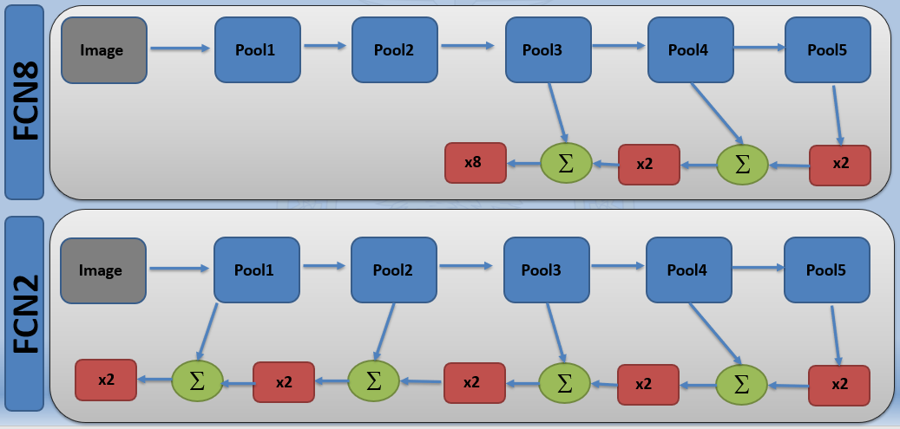
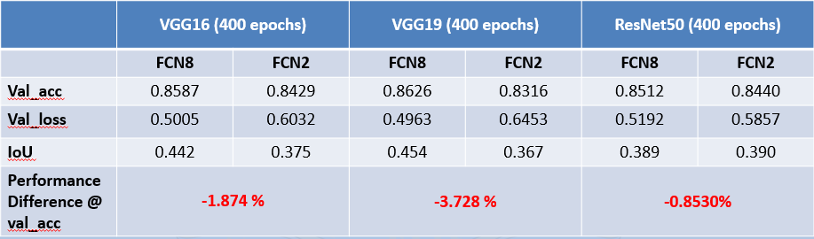
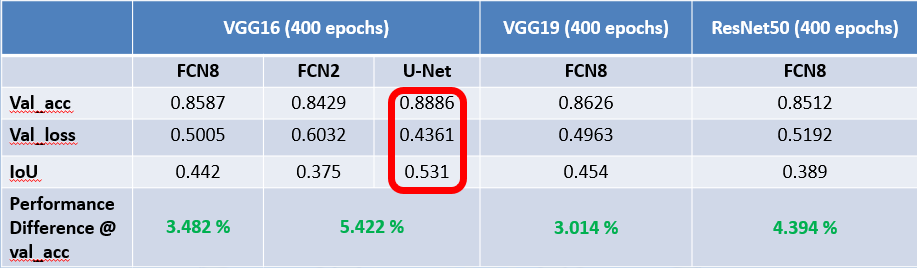

# Segmentation-keras
 
This repository includes implementation of following FCN implementations for segmentation task
 ```
 1. FCN8-VGG16
 2. FCN8-VGG19
 3. FCN8-ResNet50
 ```
Furthermore a custom FCN architecture is also implemented refered here as FCN2 including
```
 1. FCN2-VGG16
 2. FCN-VGG16
 3. FCN2-ResNet50
```
Lastly, Unet architecture is implemnted on VGG16 as following
```
 1. UNet-VGG16
```
FCN2 architecture in comparison with FCN8 is as following

## Dataset
The segmnetation data is taken from [Divam Gupta](https://github.com/divamgupta/image-segmentation-keras) available at [image Segmentation git](https://drive.google.com/file/d/0B0d9ZiqAgFkiOHR1NTJhWVJMNEU/view?usp=sharing)

## Results

### 1. FCN2 Vs FCN8 Implementations 


### 2. UNet Vs FCN Implementations 


### Citation Details
If you find this code useful in your research, please consider citing

	@misc{xbd-classification,
	author = {{Rafique, Hamza}},
	title = {Experimenting with xBD classification task for xview2 challenge using Keras},
	year = {2019},
	version = {1.0}
	address = {Air University, ISB. ham952@hotmail.com},
	url = {https://github.com/ham952/xview2-pytorch-firstrun}
	} 

### ToDo

 - Addition of copyrights in code files
 - Improving results presentation in git
